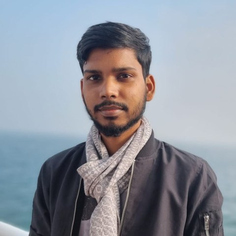

# Md Abu Sayed Shaun

AI / ML Engineer · Dhaka, Bangladesh
{ .hero-role }

I build production AI systems — **LLM**, **agentic AI**, and the retrieval and
serving infrastructure around them. Currently at Synesis IT PLC, and preparing for a master's.

Open to roles & collaborations
{ .status }

LLM
Agentic AI
RAG & retrieval
MLOps
Applied NLP

[:material-email: Email](mailto:sayedshaun4@gmail.com){ .md-button }
[:fontawesome-brands-github: GitHub](https://github.com/sayedshaun){ .md-button }
[:fontawesome-brands-linkedin: LinkedIn](https://linkedin.com/in/sayed-shaun){ .md-button }
[:material-file-document: Résumé](files/resume.pdf){ .md-button target="_blank" rel="noopener" }

## Profile

I came to machine learning through software engineering, and it still shows in how I work.
The modelling is rarely the hard part — the hard part is the data pipeline nobody documented,
the inference bill nobody forecast, and the evaluation that quietly stopped measuring anything
real. That's the half of the job I've ended up specialising in.

Day to day that means agentic systems — LLMs that call tools, route across databases, and
hold up under real traffic — plus the optimisation work that makes them affordable to run.
I also do research in low-resource NLP, which is where my published work sits, and I'm
preparing for a master's to push further into both.

### At a glance

| | |
|---|---|
| **Current role** | AI Engineer @ Synesis IT PLC |
| **Location** | Dhaka, Bangladesh |
| **Focus** | LLM · agentic AI · retrieval systems |
| **Education** | B.Sc. Computer Science & Engineering |
| **Publication** | BanSuite (EACL 2026) |
| **Looking for** | AI/ML engineering roles, research collaborations, master's programmes |
